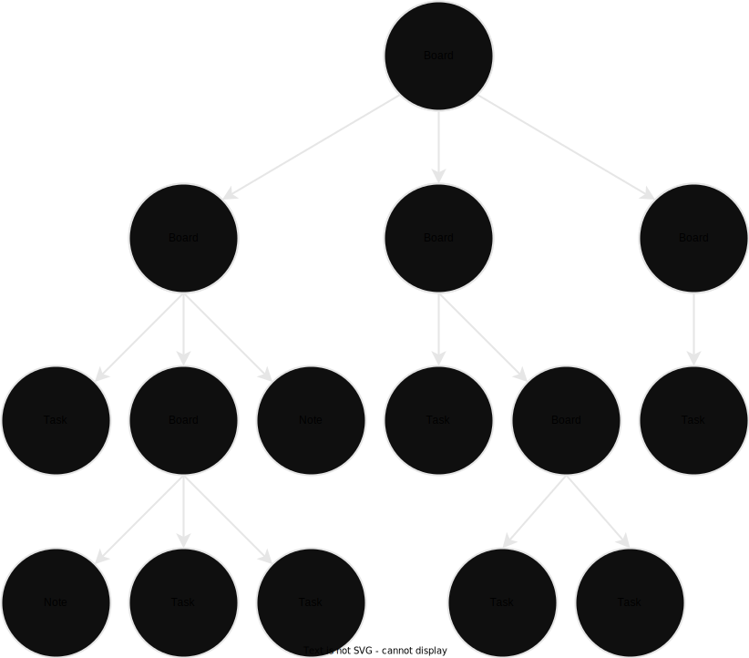
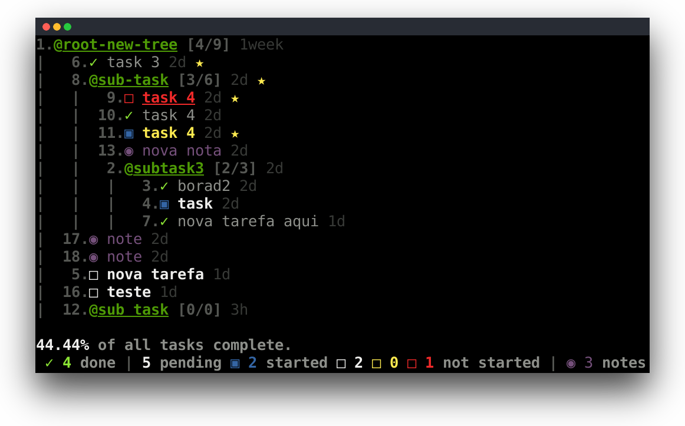
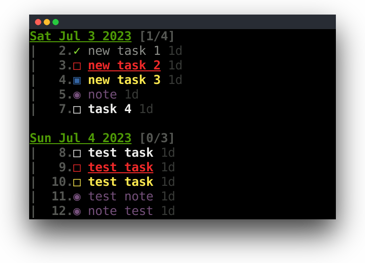

# MyTasks

This project is basead on [Taskbook](https://github.com/klaudiosinani/taskbook.git). Using the Taskbook the need arose to create sub-tasks, so I remodeled the project to use a tree structure, thus allowing to group tasks.

**Contributors are welcome. Submit your pull requests.**

### Environment
  [](https://www.python.org/downloads/release/python-392/)
  [](https://pip.pypa.io/en/stable/)

### Description
MyTasks lets you manage your tasks and notes from your terminal in a simple and efficient way, being able to group your tasks into subtasks (boards).
All this using a simple and minimalist syntax.
With Mytasks it is possible to create more than one tree, thus being able to separate the tasks, each tree is a file.
For example, you might have one tree for your work tasks and another one for some  your personal project.


### Structure
MyTasks uses a tree structure, where the leaf nodes are the tasks and notes, and the branches are the boards.

<div align="center">
  
</div>

## Install

  Clone this repository.
  ```
  git clone https://github.com/fanhenrique/my-tasks.git
  ```
  Install dependencies
  ```
  pip install -r requirements.txt
  ```
  Install zip before running script `install.sh`
  ```
  sudo apt install zip
  ``` 
  Use bash script to install. 
  ```
  ./install.sh
  ```
## Usage

### Tree View

Now in the terminal just use the command `mytasks`.

<div align="center">
  
</div>

### Timeline View

The timeline view allows you to see the creation dates of tasks and notes. Use the `--timeline`/`-tl` command.


<div align="center">
  
</div>

### Context (switch between trees)

Use `--file`/`-f` option with your file of tree following right after.
All trees are stored in the home directory, `~/my-tasks`.
To create a new tree just use a never used file name.

  ```
  mytasks --file tree.txt
  ```


### Help

  Use option `--help` for help.
  
  ```
 mytasks --help
  ```
### Node Operations
#### Create node Board

  To create a new board use the `--board`/`-b` option with your description following right after. Here is recommended use name without space.
    
  ```
  mytasks --board my-board
  ```
  
> **Note** 
> It is recommended to use the name without a space, 
>as it is possible to search for subtasks by name. And in the terminal it is not pleasant to search for things that have a space in the name.
>See the example below.
>```
>mytasks @my-borad
>```
>```
>mytasks "@my board"
>```
  

#### Create node Task

  To create a new task use the `--task`/`-t` option with your description following right after.
  
  ```
  mytasks --task write document
  ```

#### Create node Note

  To create a new note use the `--note`/`-t` option with your description following right after.
    
  ```
 mytasks --note caution with orthography at the document
  ```

#### Delete node

  To delete some node use the `--delete`/`-d` option followed by the list of ids of the nodes.
  
  ```
 mytasks --delete 3 4 7 9
  ```

#### Edit node

  To edit some node use the `--edit`/`-e` option followed by the new name node. In this case it is necessary to indicate the id of the node.
  
  ```
  mytasks 3 --edit new name node
  ```

#### Starred node

  To mark a node as starred, use the `--star`/`-x` option followed by the list of ids of the tasks.
    
  ```
  mytasks --star 2 3 5
  ```
### Task Operations
#### Checked Task

  To mark a task as complete/incomplete, use the `--check`/`-c` option followed by the list of ids of the tasks.
    
  ```
  mytasks --check 2 3 5
  ```

#### Started Task

  To mark a task as started/not started, use the `--started`/`-s` option followed by the list of ids of the tasks.
  
  ```
  mytasks --started 2 3 5
  ```

#### Change priority level Task

  To change the priority level of a task, use the `--priority <level>`/`-p <level>` option. In this case it is necessary to indicate the id of the task.

  - 0 - Default priority 
  - 1 - Low priority 
  - 2 - High priority 

  ```
  mytasks 4 --priority 1
  ```
  
## Contact
<div>
  <p><strong>Henrique Fan</strong></p>
  <a href = "fanhenrique@gmail.com"> </a>
  <a href="https://www.linkedin.com/in/fanhenrique/" target="_blank"></a>
</div>
