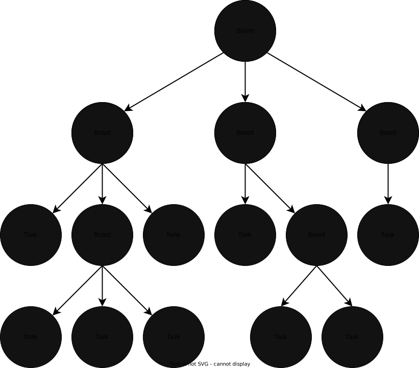

# MyTasks

## Description

MyTasks allows you to simply and efficiently manage your tasks and notes from your terminal. You can also organize your tasks into subtasks (boards). All this using a simple and minimal syntax.

### Structure
MyTasks uses a tree structure, where the leaf nodes are the tasks and notes, and the branches are the boards.

  

## Install

## Usage

### Help

#### Create Board
#### Create Task
#### Create Note
#### Delete Node
#### Edit Node
#### Starred Node

#### Checked Task
#### Started Task
#### Change prioirty level Task
